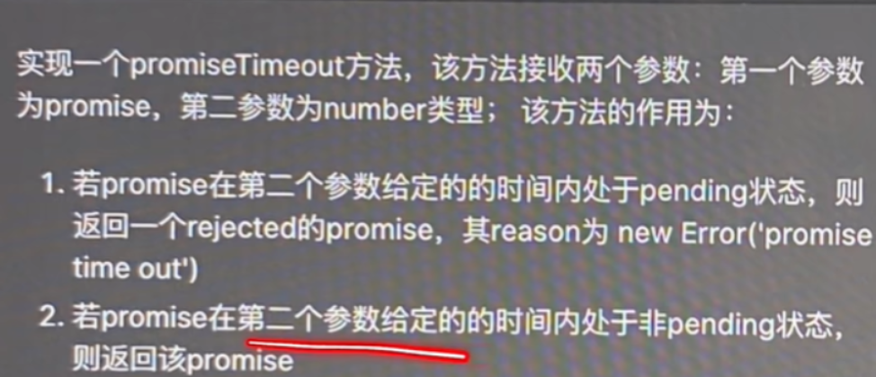

#### 1、实现一个 promiseTimeout 方法(promise.race、setTimeout)



> 解题思路：
>
> 1、由于最终返回的都是 promise，且状态为非 pending，所以想到使用 Promise.race()来实现
>
> 2、要求 1 中需要返回 rejected 的 promise，可以通过 new Promise 来实现
>
> 3、时间上的限制通过 setTimeout 进行处理

```javascript
function promiseTimeout(promise, time) {
  const timePromise = new Promise((resolve, reject) => {
    setTimeout(() => {
      reject(new Error('promise time out'));
    }, time);
  });
  return Promise.race([promise, timePromise]);
}
```

#### 2、实现十进制数转换为其它进制数方法

题目：给定十进制数 M，以及需要转换的进制数 N。将十进制数 M 转化为 N 进制数

> 思考：类比十进制转为二进制，是用的短除法，从下到上取值，那么在数据结构中，就可以使用栈来存储每次得到的余数

```javascript
// 实现一个栈
function Stack() {
  let items = [];
  this.push = function (e) {
    items.push(e);
  };
  this.pop = function (e) {
    return items.pop(); // 取最后一项，栈内元素会少一项
  };
  this.peek = function (e) {
    return items[items.length - 1]; // 返回栈顶元素，栈内元素不变
  };
  this.isEmpty = function (e) {
    return items.length === 0;
  };
  this.size = function () {
    return items.length;
  };
  this.clear = function () {
    items = [];
  };
}
function fn(num, base) {
  let stack = new Stack();
  let rem; // 余数
  let baseString = '';
  let digits = '0123456789ABCDEF'; // 一张映射表
  while (num > 0) {
    rem = Math.floor(num % base);
    stack.push(rem);
    num = Math.floor(num / base);
  }
  while (!stack.isEmpty()) {
    baseString += digits[stack.pop()].toString();
  }
  return baseString;
}

console.log(fn(6, 2)); // 110
console.log(fn(11, 16)); // B
```

#### 3、异步串行编程题：实现 createFlow 函数

```javascript
const delay = (ms) => new Promise((resolve) => setTimeout(resolve, ms));

const subFlow = createFlow([() => delay(1000).then(() => console.log('c'))]);

createFlow([
  () => console.log('a'),
  () => console.log('b'),
  subFlow,
  [() => delay(1000).then(() => console.log('d')), () => console.log('e')],
]).run(() => {
  console.log('done');
});

// 需要按照 a,b,延迟1秒,c,延迟1秒,d,e, done 的顺序打印
```

按照上面的测试用例，实现 `createFlow`：

- `flow` 是指一系列 `effects` 组成的逻辑片段。
- `flow` 支持嵌套。
- `effects` 的执行只需要支持串行。

> 解题思路：一眼看去题目很复杂，但是仔细读题后可以发现，该函数传入的是一个数组，返回的是一个对象，对象里面有一个 run 方法可执行，并且最后才执行 run 方法，这就确定了该函数参数和返回值。
>
> 数组参数有几下几种类型：
>
> - 普通函数：() => console.log("a")
> - 异步函数：() => delay(1000).then(() => console.log("c"))
> - 数组：[() => delay(1000).then(() => console.log("d")), () => console.log("e")]
> - 嵌套：createFlow([() => delay(1000).then(() => console.log("c"))])
>
> 由于参数中还有数组，可以考虑将数组打平，再针对异步和嵌套函数做处理。

```javascript
function createFlow(effects = []) {
  const funcs = effects.flat();
  // 因为参数中有异步函数，这里使用async、await
  const run = async function (cb) {
    for (let fn of funcs) {
      // 针对传入的嵌套createFlow进行判断
      let task = (await fn.run) ? fn.run : fn;
      task();
    }
    // 最后执行run传入的方法
    cb && cb();
  };
  return { run };
}
```
