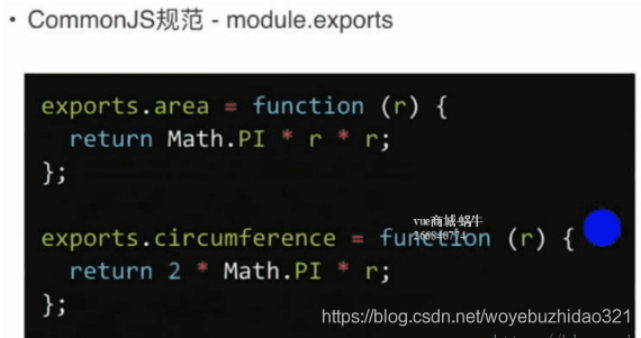
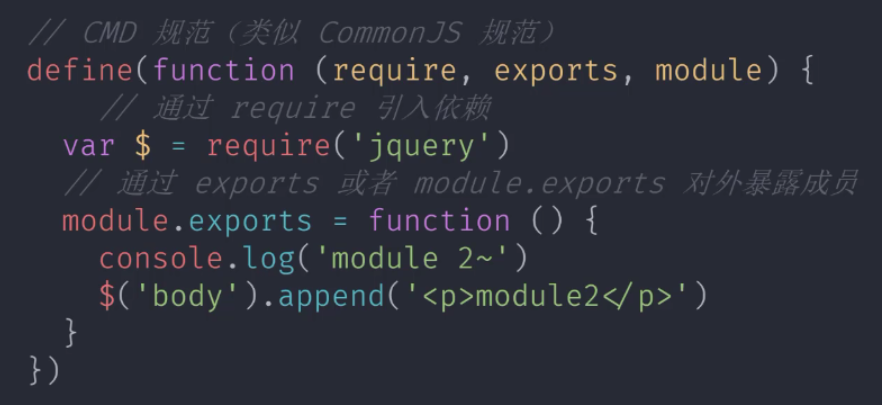
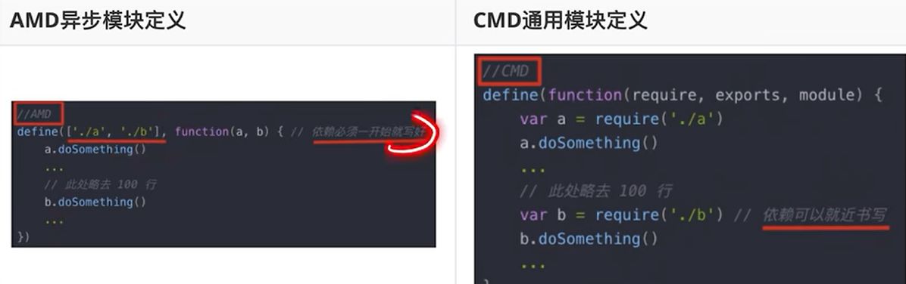
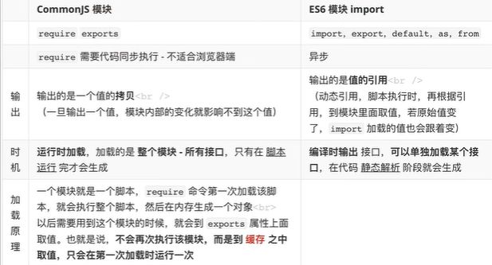

#### 1. 模块化标准有哪些？各有什么特点？

##### 1.1 commonJS 规范

NodeJs 提出的一种标准，以**同步模式**加载模块。

如果浏览器端使用 commonJS，会导致效率低下，我们每次页面加载，都会导致大量请求出现，所以早期浏览器没有采用 commonJS 规范，而是采用 AMD。commonJS 特点如下：

- 一个文件就是一个模块
- 每个模块都有单独的作用域
- 使用 module.exports 导出成员
- 通过 require 函数载入模块

CommonJS 规范—是通过 module.exports 定义的，在前端浏览器里面并不支持 module.exports,通过 node.js 后端使用的。Nodejs 端是使用 CommonJS 规范的，前端浏览器一般使用 AMD、CMD、ES6 等定义模块化开发的。



##### 1.2 AMD 异步模块定义规范

推出了出名的库称为**Require.js**,实现了 AMD 规范。

```javascript
// 使用define定义一个模块
define('module1', ['jquery', './module2'], function ($, module2) {
  return {
    start: function () {
      $('body').animate({ margin: '200px' });
      module2();
    },
  };
});

// 使用require函数加载模块，
// 当require.js需要去加载一个模块的话，内部会自动去创建一个script标签发送对脚本文件的请求，并执行相应的模块代码。
require(['./module1'], function (module1) {
  module1.start();
});
```

目前绝大多数第三方库都支持 AMD 规范，但是

- 但是 AMD 使用起来相对复杂
- 模块 JS 文件请求频繁，会消耗性能

##### 1.3 CMD 通用模块规范

**sea.js**库是淘宝推出来的



> 还有一种 umd ：一种同时兼容了 amd、cmd、common.js 的规范。amd cmd 通常只能在浏览器中使用**, **commonjs 只能在服务端(Node)\环境下使用, 这样导致我们基于其中某一种模块规范写的 js 模块无法在服务端和浏览器端进行复用。umd 解决了这个问题。

```javascript
(function (root, factory) {
  if (typeof exports === 'object' && typeof module === 'object')
    // commonjs
    module.exports = factory();
  else if (typeof define === 'function' && define.amd)
    // amd、cmd
    define([], factory);
  else if (typeof exports === 'object')
    // commonjs
    exports['math'] = factory();
  // 全局对象, 浏览器中是 window
  else root['math'] = factory();
})(this, function () {
  return {
    add: function (left, right) {
      return left + right;
    },
  };
});
```

jq 源码里面就是采用了 umd 规范去做兼容，所以 jq 可以说是 umd 规范的一种代表。

##### 1.4 ES Modules 模块化标准规范

ES Modules 规范 是在 ECMAScript2015(ES6)中提出的 Module 模块标准。通过**给 script 添加 type = module** 的属性，就可以以 ES Module 的标准执行其中的 JS 代码。

```javascript
<script type="module">
    console.log(123)
</script>

// ./modulejs
const foo = 'es modules'
export { foo }

// ./app.js
import { foo } from './module.js'
console.log(foo) // => es modules

// export defaults
export default var name = 'es module'
import name form './module.js'
```

- 自动采用严格模式，忽略’use strict’
- 每个 ESM 模块都是单独的私有作用域
- ESM 是通过 CORS 去请求外部 JS 模块的
- ESM 的 script 标签会延迟脚本执行

ES6 在语言标准的层面上，实现了模块功能，成为浏览器和服务器通用的模块解决方案。

- 每一个模块只加载一次， 每一个 JS 只执行一次， 如果下次再去加载同目录下同文件，直接从内存中读取；
- 每一个模块内声明的变量都是局部变量， 不会污染全局作用域；
- 模块内部的变量或者函数可以通过 export 导出；
- 一个模块可以导入别的模块

**模块功能主要由两个命令构成：export 和 import。**

```javascript
// import { name } from './module'
import { name } from './module.js'; // 不可以省略.js扩展名 不然报错
// console.log(name)

// import { lowercase } from './utils'
import { lowercase } from './utils/index.js'; // 在原生ES Module环境 index.js也不能省略
// console.log(lowercase('HHH'))

// import { name } from 'module.js'
import { name } from './module.js'; // ./不能省略
// import { name } from '/04-import/module.js'
// import { name } from 'http://localhost:3000/04-import/module.js'
// console.log(name)

// --------------

// import {} from './module.js'
// import './module.js'

// ---------------

import * as mod from './module.js'; //如果导出的成员比较多，可以采用 *的形式
// console.log(mod)

// ---------------

// var modulePath = './module.js'
// import { name } from modulePath // 报错
// console.log(name)

// if (true) { // 不能嵌套在if中  报错
//   import { name } from './module.js'
// }

// import('./module.js').then(function (module) {   // 动态导入的正确形式
//   console.log(module)
// })

// ----------------

// import { name, age, default as title } from './module.js' // 导出默认成员
import title, { name, age } from './module.js'; // 导出默认成员
console.log(name, age, title);
```

```javascript
// export单独使用时，{}时固定语法，虽然看起来跟字面量对象一样，但是导出的并不是字面量对象
// 导入模块，{} 固定语法，不是对象的解构
let num1 = 1;
let num2 = 2;
export { num1, num2 };

import { num1, num2 } from './module.js';

// export default 组合使用时，{} 代表导出的是对象字面量
// 导入模块，不可以使用 {} 写法
let num1 = 1;
let num2 = 2;
export default { num1, num2 };

import module from './module.js';
console.log(module.num1);
```

注意事项：

1. export { } 是一个固定用法，并非导出了一个对象
2. 导出的值是引用关系，是只读成员，不可进行修改
3. 导入的时候必须使用完整的名称，不可省略扩展名

导入用法：

1. 导入时，可以使用绝对路径，相对路径如果是同目录必须使用‘./’，不可省略
2. 只加载不提取，可以使用：`import 'module.js'`或者 `import {} from 'module.js'`
3. 全部导入，使用：`import * as mod from 'module.js'`
4. import 关键词只能出现在最外层的作用域，不能嵌套在 if 等条件语句中
5. 动态加载时，需要使用以下写法：

```javascript
import('./module.js').then(function (module) {
  console.log(module);
});
```

#### 2. AMD 和 CMD 的区别？

1. AMD 是 require.js 推广过程中对模块定义的规范化产出，CMD 是 sea.js 推广过程中对模块定义的规范化产出。

2. require.js 需要解决的问题是，多个 JS 文件可以有依赖关系，被依赖的文件需要早于依赖它的文件加载到浏览器，JS 加载的时候浏览器停止页面渲染，加载文件越多，页面失去响应时间越长。sea.js 要解决的问题和 require.js 一样，只不过模块定义的方式和模块加载时机有所不同。

3. AMD 推崇**依赖前置**，CMD 推崇**依赖就近**

   

#### 3. commonJS 和 ESModules 区别（exports 和 export 区别）


