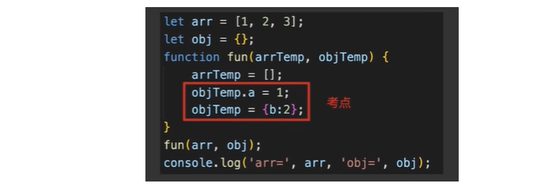

最后输出：arr=[1,2,3]，obj={a: 1}

> 原因：arr 和 obj 为引用数据类型，在 fun 函数中，arrTemp = []，相当于重新赋值，改变了内存地址，指向了一个新的对象，也就是在堆内存开辟了一块新的空间，因此不会相互影响。只有修改对象属性时，才会相互影响。例如，如果将 arrTemp = []改为 arrTemp.push(4)或者通过索引来改变 arrTemp[3]=4 时，此时输出的 arr 为[1,2,3,4]

详细说明请参考 https://blackstarxing.github.io/2019-12-30-value-copy-and-reference-copy.html
